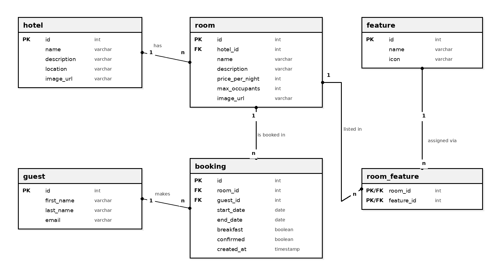

# Database Design

## Tables

### hotel

| Key | Column | Type | Reference |
|---|---|---|---|
| PK | id | int | |
| | name | varchar | |
| | description | varchar | |
| | location | varchar | |
| | image_url | varchar | |

### room

| Key | Column | Type | Reference |
|---|---|---|---|
| PK | id | int | |
| FK | hotel_id | int | hotel.id |
| | name | varchar | |
| | description | varchar | |
| | price_per_night | int | |
| | max_occupants | int | |
| | image_url | varchar | |

### guest

| Key | Column | Type | Reference |
|---|---|---|---|
| PK | id | int | |
| | first_name | varchar | |
| | last_name | varchar | |
| | email | varchar | |

### booking

| Key | Column | Type | Reference |
|---|---|---|---|
| PK | id | int | |
| FK | room_id | int | room.id |
| FK | guest_id | int | guest.id |
| | start_date | date | |
| | end_date | date | |
| | breakfast | boolean | |
| | confirmed | boolean | |
| | created_at | timestamp | |

### feature

| Key | Column | Type | Reference |
|---|---|---|---|
| PK | id | int | |
| | name | varchar | |
| | icon | varchar | |

### room_feature

| Key | Column | Type | Reference |
|---|---|---|---|
| PK, FK | room_id | int | room.id |
| PK, FK | feature_id | int | feature.id |

## Relationships

| Relationship | Meaning |
|---|---|
| hotel 1 --- n room | One hotel has many rooms |
| room 1 --- n booking | One room can have many bookings |
| guest 1 --- n booking | One guest can make many bookings |
| room n --- m feature via room_feature | Rooms can have many features and features can belong to many rooms |

## UML Diagram

